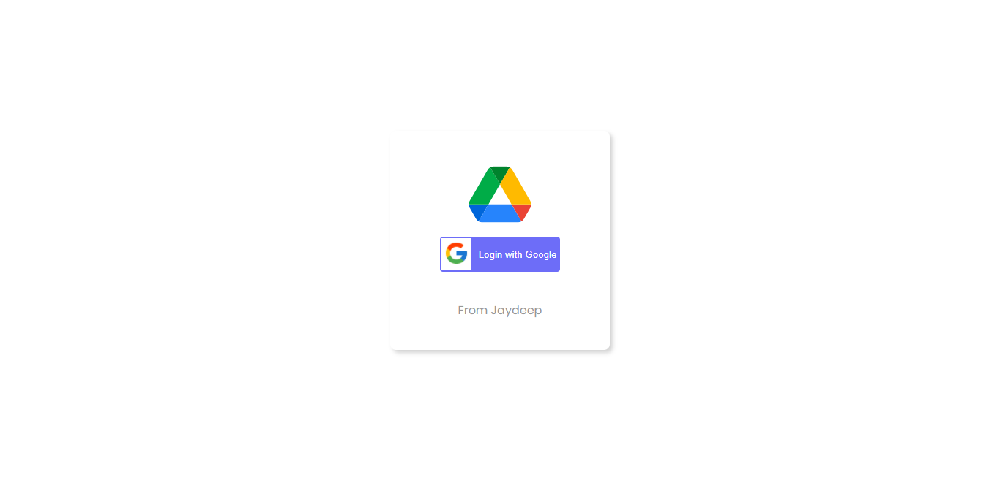
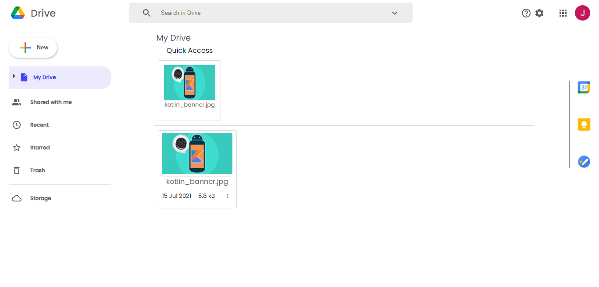
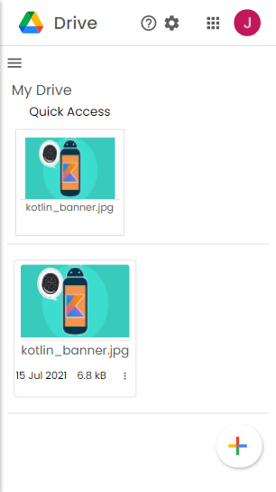

# Google Drive Clone

  

 

>Google Drive clone made using ReactJS & FIRBASE (UNDER DEVLOPEMENT)  
> App made to brush up the React.JS skills 

## ⚙️ Detailed Functionality
* Users have to authenticate themselves by Google OAuth2.0
* Login Users can Read,Creat,Stared and Delete there files
* Users can remove files from stared and add them any time
* User can view their profile 
* User can copy the link of file as well
* User can logout any time from the app

 
## 🚀 Tech and Tools Used

* React.JS , Material UI ,Firebase ..
* VS code
* Material UI icons

## 📸 Screenshots

## login page

 
## Home Page

 
## Mobile View

 
### LINK : 
https://driveclone-6e9ac.web.app/